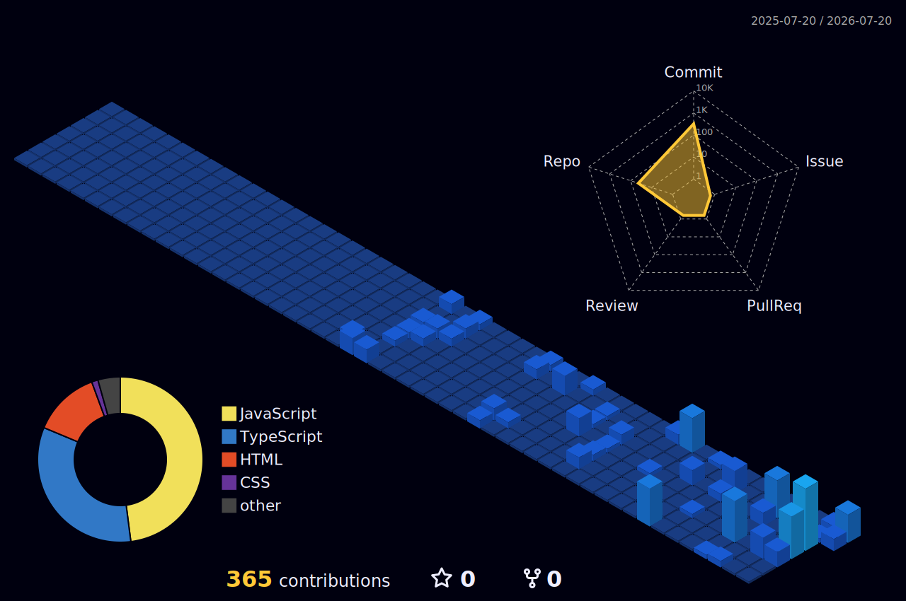
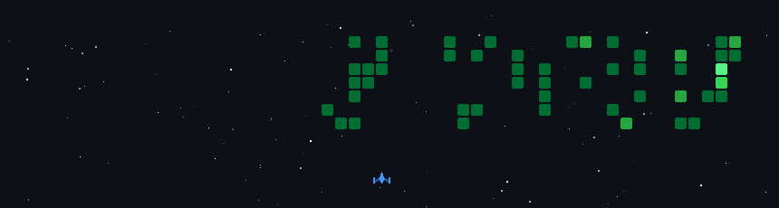

<!-- 1. Custom Hero Banner Image -->

  

<!-- Profile Views counter -->

  

---

### 📌 About Me

* 🎓 I'm currently balancing academic work with a dedicated 4-hour daily schedule studying full-stack web development.
* 🚀 I'm currently learning Next.js, Express.js & MongoDB to build full stack web applications.
* 🤝 I'm looking to collaborate on full stack Next.js projects.
* 💡 I'm looking for help with finding project ideas to build and expand my portfolio.
* 💬 Ask me about anything related to Web Development or JavaScript, I'm happy to discuss!
* 🎯 I'm working towards landing my first developer role.
* ⚡ Fun fact: I'm turning my passion for tech into a career path!

---

### 🏆 GitHub Stats & Trophies

<!-- Dynamically Generated Trophies -->

  

  <!-- My GitHub Stats Card -->
  
  <!-- DenverCoder1 Streak Stats -->
  

---

### 📈 Activity Graph

  <!-- Dynamic 31-day activity graph -->
  

---

### 🗓️ Contributions Calendar (3D View)

  <!-- Generated by the yoshi389111 profile-3d action -->
  

---

### 🛠️ Languages & Tools

  <b>Programming Languages</b> 
  
  
  
  

  <b>Frontend</b> 
  
  
  

  <b>Backend & Database</b> 
  
  
  

  <b>Tools</b> 
  
  
  

---

### 📊 Top Languages Used

  

---

### 🔗 Connect with Me

  
  
  

<!-- Space Invaders Shooter Game Generated Output -->

  

